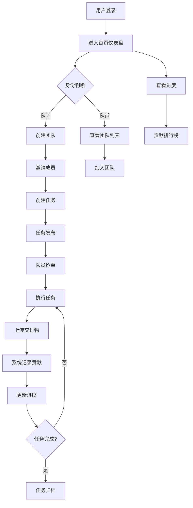

## 1. Product Overview
赛队管家（TeamTrack）是一款基于微信生态的轻量级大学生竞赛协作管理小程序，旨在解决学生竞赛团队中"进度不透明、责任推诿、队长一人焦虑"的痛点，让团队管理不再依赖人情，实现协作效率的最大化。

## 2. Core Features

### 2.1 User Roles
| Role | Registration Method | Core Permissions |
|------|---------------------|------------------|
| 队长 | 微信授权注册 | 创建团队、分配任务、查看进度、管理成员 |
| 队员 | 微信授权注册 | 领取任务、提交交付物、查看团队进度 |

### 2.2 Feature Module
1. **首页仪表盘**: 团队进度概览、任务看板、贡献排行榜
2. **任务中心**: 任务抢单、任务详情、进度更新
3. **贡献举证**: 交付物上传、版本记录、贡献度统计
4. **团队管理**: 成员管理、竞赛信息、消息通知

### 2.3 Page Details
| Page Name | Module Name | Feature description |
|-----------|-------------|---------------------|
| 首页仪表盘 | 进度概览 | 环形进度图展示整体完成度，任务状态分布 |
| 首页仪表盘 | 任务看板 | 拖拽式任务列表，支持待领取/进行中/已完成状态 |
| 首页仪表盘 | 贡献排行榜 | 按贡献度排序的成员列表，激励队员积极性 |
| 任务中心 | 任务抢单 | 队员自主领取任务，支持条件筛选 |
| 任务中心 | 任务详情 | 任务描述、截止时间、依赖关系、负责人 |
| 贡献举证 | 交付物上传 | 支持多种格式文件上传，自动生成版本记录 |
| 贡献举证 | 贡献统计 | 可视化展示个人贡献度和团队贡献分布 |
| 团队管理 | 成员管理 | 添加/移除成员，角色分配，权限设置 |
| 团队管理 | 竞赛信息 | 竞赛名称、时间线、关键节点提醒 |

## 3. Core Process
用户登录后进入首页，队长可以创建团队并邀请成员加入。队长创建任务并设置截止时间，队员通过"抢单"方式领取任务。任务执行过程中，队员定期更新进度并上传交付物，系统自动记录贡献度。队长可以实时查看团队进度，及时发现问题并调整。

## 4. User Interface Design
### 4.1 Design Style
- **主色调**: 活力橙 (#FF6B35) - 代表热情、创造力和行动力
- **辅助色**: 科技蓝 (#1E90FF) - 代表专业、信任和协作
- **中性色**: 深空灰 (#1A1A2E) 背景，白色 (#FFFFFF) 卡片
- **按钮风格**: 圆角矩形，渐变色填充，悬浮放大效果
- **字体**: 思源黑体，现代简洁的无衬线字体
- **布局风格**: 卡片式布局，清晰的信息层级
- **图标风格**: 线性图标，简洁明了

### 4.2 Page Design Overview
| Page Name | Module Name | UI Elements |
|-----------|-------------|-------------|
| 首页仪表盘 | Hero区域 | 渐变背景、品牌Logo、核心价值主张、CTA按钮 |
| 首页仪表盘 | 进度卡片 | 环形进度图、统计数字、状态标签 |
| 首页仪表盘 | 任务看板 | 三列布局、卡片拖拽、状态颜色区分 |
| 任务中心 | 任务列表 | 瀑布流布局、任务卡片、抢单按钮 |
| 贡献举证 | 统计图表 | 柱状图、饼图、进度条 |
| 团队管理 | 成员卡片 | 头像、姓名、角色标签、贡献值 |

### 4.3 Responsiveness
- 移动端优先设计，适配微信小程序环境
- 桌面端自适应布局，支持更大屏幕显示
- 触控友好的交互设计，按钮尺寸适合手指点击

### 4.4 Visual Effects
- 渐变背景和毛玻璃效果营造层次感
- 卡片悬浮阴影和微动效提升交互体验
- 进度动画和数字滚动效果增强视觉反馈
- 图表动画展示数据变化趋势