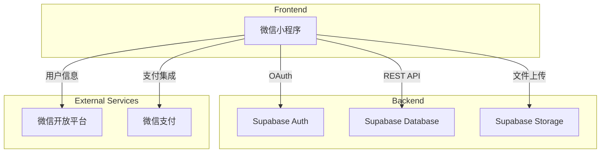
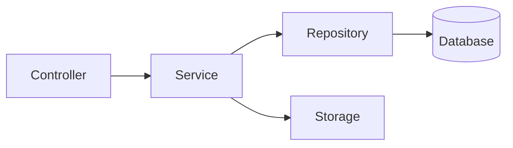
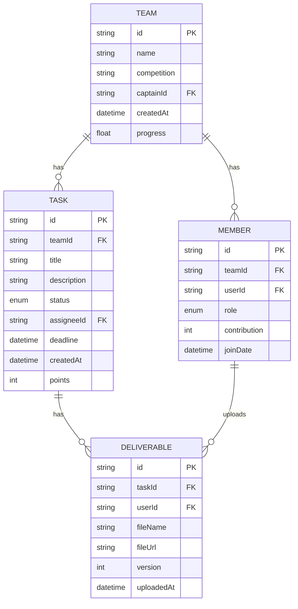

## 1. Architecture Design


## 2. Technology Description
- **Frontend**: 微信小程序原生开发 + TypeScript
- **Backend**: Supabase (PostgreSQL数据库 + Auth认证 + Storage存储)
- **Initialization Tool**: vite-init (用于创意展示页面)
- **Design System**: TailwindCSS 3
- **Chart Library**: ECharts (数据可视化)

## 3. Route Definitions
| Route | Purpose |
|-------|---------|
| / | 首页仪表盘 |
| /tasks | 任务中心 |
| /contribution | 贡献举证 |
| /team | 团队管理 |
| /profile | 个人中心 |

## 4. API Definitions
```typescript
interface Team {
  id: string;
  name: string;
  competition: string;
  captainId: string;
  createdAt: Date;
  progress: number;
}

interface Task {
  id: string;
  teamId: string;
  title: string;
  description: string;
  status: 'pending' | 'in_progress' | 'completed';
  assigneeId: string | null;
  deadline: Date;
  createdAt: Date;
  points: number;
}

interface Member {
  id: string;
  teamId: string;
  userId: string;
  role: 'captain' | 'member';
  contribution: number;
  joinDate: Date;
}

interface Deliverable {
  id: string;
  taskId: string;
  userId: string;
  fileName: string;
  fileUrl: string;
  version: number;
  uploadedAt: Date;
}
```

## 5. Server Architecture Diagram


## 6. Data Model
### 6.1 Data Model Definition


### 6.2 Data Definition Language
```sql
CREATE TABLE teams (
    id UUID PRIMARY KEY DEFAULT uuid_generate_v4(),
    name VARCHAR(100) NOT NULL,
    competition VARCHAR(100) NOT NULL,
    captain_id UUID REFERENCES auth.users(id),
    created_at TIMESTAMP DEFAULT NOW(),
    progress FLOAT DEFAULT 0
);

CREATE TABLE tasks (
    id UUID PRIMARY KEY DEFAULT uuid_generate_v4(),
    team_id UUID REFERENCES teams(id),
    title VARCHAR(100) NOT NULL,
    description TEXT,
    status VARCHAR(20) DEFAULT 'pending',
    assignee_id UUID REFERENCES auth.users(id),
    deadline TIMESTAMP,
    created_at TIMESTAMP DEFAULT NOW(),
    points INT DEFAULT 10
);

CREATE TABLE members (
    id UUID PRIMARY KEY DEFAULT uuid_generate_v4(),
    team_id UUID REFERENCES teams(id),
    user_id UUID REFERENCES auth.users(id),
    role VARCHAR(20) DEFAULT 'member',
    contribution INT DEFAULT 0,
    join_date TIMESTAMP DEFAULT NOW()
);

CREATE TABLE deliverables (
    id UUID PRIMARY KEY DEFAULT uuid_generate_v4(),
    task_id UUID REFERENCES tasks(id),
    user_id UUID REFERENCES auth.users(id),
    file_name VARCHAR(200) NOT NULL,
    file_url VARCHAR(500) NOT NULL,
    version INT DEFAULT 1,
    uploaded_at TIMESTAMP DEFAULT NOW()
);

GRANT SELECT ON teams TO anon;
GRANT SELECT ON tasks TO anon;
GRANT SELECT ON members TO anon;
GRANT SELECT ON deliverables TO anon;

GRANT ALL PRIVILEGES ON teams TO authenticated;
GRANT ALL PRIVILEGES ON tasks TO authenticated;
GRANT ALL PRIVILEGES ON members TO authenticated;
GRANT ALL PRIVILEGES ON deliverables TO authenticated;
```